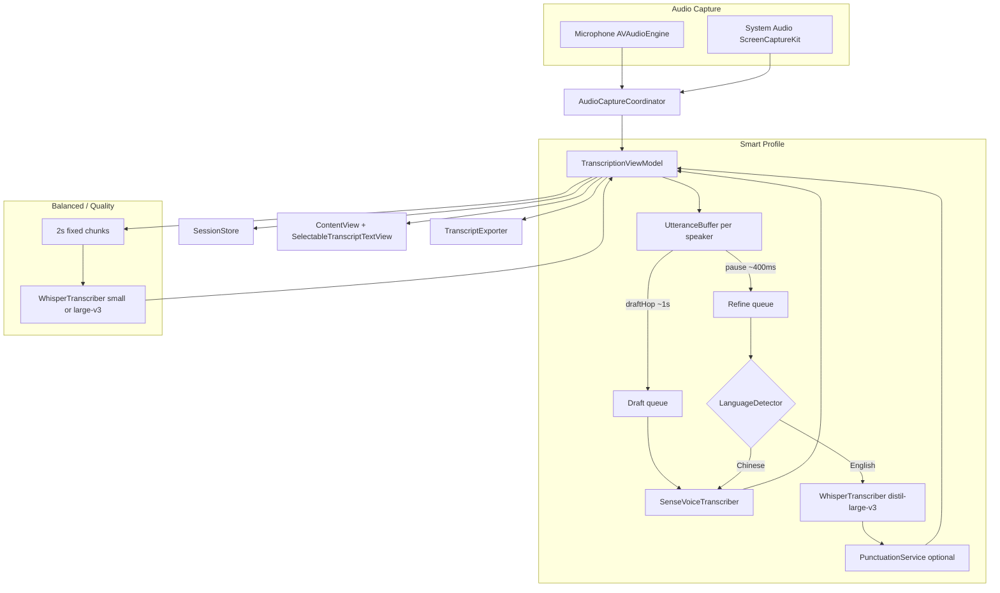

# Livescript Technical Design

Last updated to match current code on `main`.

## Product Scope (v1)

- macOS floating live transcription window (SwiftUI + AppKit).
- Capture from microphone, system audio, or both (`Mic`, `System`, `Mixed`).
- On-device ASR with **English / Chinese** support; Smart profile routes refine by detected script.
- **Smart** profile (default): Zoom-style **draft → refine** captions with incremental draft text.
- **Balanced / Quality** profiles: single-pass Whisper on fixed 2s chunks.
- Local transcript export (`.txt`, `.md`; refined segments only).
- User-toggleable **Stealth** mode for screen-capture exclusion (default on).
- Long-session resilience via session checkpoints and append logs.
- 32 SPM unit tests for pipeline, language routing, and filtering logic.

## High-Level Architecture



## Speed Profiles

| Profile | Engine | Draft | Refine (on pause) | Chunk / hop |
|---------|--------|-------|-------------------|-------------|
| **Smart** (default) | SenseVoice + Whisper | ~1s incremental hops, text accumulation | EN: distil-large-v3 · ZH: SenseVoice | pause 400ms, max utterance 8s |
| **Balanced** | Whisper `small` | — | — (single pass) | 2s chunks (32k samples) |
| **Quality** | Whisper `large-v3` | — | — (single pass) | 2s chunks, strict decode thresholds |

- Profile stored in `UserDefaults` (`TranscriptionSpeedProfile`); legacy value `realtime` maps to **Smart**.
- Profile cannot be changed while a session is running.

## Smart Captions Pipeline

### Utterance segmentation (`UtteranceBuffer`)

Each speaker path (mic / system) owns an `UtteranceBuffer` inside `SpeakerUtteranceState`:

1. **Speech detection** — RMS energy gate by default; optional Silero VAD when model is available (`VoiceActivityDetector`).
2. **Draft hops** — every ~1s of new speech, emit `UtteranceEvent.draftHop` with only the **new** audio slice (suffix of buffer), keeping decode size bounded.
3. **Utterance boundary** — ~400ms silence or max utterance length (8s Smart) emits `UtteranceEvent.utteranceComplete` with full utterance audio.
4. **VAD reset** — `transcriber.resetVoiceActivity()` on utterance boundary.

### Draft path

- `processDraftQueue` serializes draft decode per speaker (`isDraftDecoding`).
- Each hop calls `transcribeDraft` → `SenseVoiceTranscriber`.
- Slice text merged into `accumulatedDraftText` via `TranscriptionPipelineSupport.appendDraftText` (overlap-aware suffix/prefix merge).
- UI updates one **draft** segment per utterance (`TranscriptSegmentPhase.draft`); draft and refined text share the same styling (no gray partial mode).
- Stale draft results skipped when a newer hop is already queued (`finishDraft` checks `pendingDrafts`).

### Refine path

- Triggered on utterance complete (or flush on Stop).
- `processRefineQueue` serializes refine per speaker (`isRefining`); pending jobs coalesce to latest when backed up.
- `transcribeRefine` routing (`LanguageDetector.shouldRefineWithEnglishWhisper`):
  - **English** → `WhisperTranscriber` with `distil-large-v3`, forced `language: "en"`.
  - **Chinese / unknown script** → `SenseVoiceTranscriber` (distil-large-v3 is English-only).
- Optional `PunctuationService` (ct-punc) runs after English refine only.
- Refine **replaces** the draft segment in place (`phase: .refined`, `isFinal: true`); export includes refined segments only.

### Legacy path (Balanced / Quality)

- Rolling `micBuffer` / `systemBuffer` with fixed 2s non-overlapping pops (`TranscriptionPipelineSupport.popAudioSlice`).
- `TranscriptionWorkQueue` serializes Whisper decode per speaker.
- Segments published directly as refined.

## Module Design

### 1) App and UI

- `LivescriptApp` injects a shared `TranscriptionViewModel`.
- `ContentView` header:
  - Source picker (`Mic`, `System`, `Mixed`)
  - Speed picker (`Smart`, `Balanced`, `Quality`)
  - **Stealth** checkbox (default checked) — toggles screen-capture visibility
  - Model folder menu, Start/Stop
- `ContentView` footer:
  - Model preparation / download progress
  - System capture status + Open Settings shortcut on denied/error
  - Mic / System level meters
  - Session timer, status message, Export menu (TXT / Markdown)
- `FloatingWindowConfigurator`:
  - Floating always-on-top window, transparent title bar
  - `sharingType = .none` when Stealth on, `.readOnly` when off
  - Preference persisted in `UserDefaults` (`StealthEnabled`, default `true`)
- `SelectableTranscriptTextView` (`NSTextView`):
  - Multi-line text selection
  - Auto-scroll follows bottom unless user scrolls up (`followBottom` coordinator flag)
- Speaker labels colorized (`You` blue, `System` green); repeated labels suppressed when same speaker continues.

### 2) Audio Capture (`AudioCaptureCoordinator`)

- **Mic** — `AVAudioEngine` tap, convert to mono 16 kHz float PCM; listens for default input device changes.
- **System** — `ScreenCaptureKit` (`SCStream`) audio output.
- Emits `CapturedAudioChunk(source: .mic | .system, samples: [Float])`.
- Emits `SystemCaptureStatus`: `notStarted`, `starting`, `running`, `denied`, `error`.
- `MicrophoneDeviceInfo` classifies input as built-in vs external (headset) for echo filtering.
- Permission hardening: `CGPreflightScreenCaptureAccess` / `CGRequestScreenCaptureAccess`; detailed error context on failures.

### 3) Transcription Service (`LivescriptTranscriptionService`)

Actor orchestrating all ASR backends:

| Component | Role |
|-----------|------|
| `SenseVoiceTranscriber` | Smart draft; Chinese refine |
| `WhisperTranscriber` (refine) | English refine (`distil-large-v3`) |
| `WhisperTranscriber` (main) | Balanced/Quality single-pass |
| `PunctuationService` | Optional ct-punc after English refine |
| `VoiceActivityDetector` | Optional Silero VAD (not on hot path when unavailable) |

- Local-first model resolution from user-selected folder; WhisperKit fallback download with progress callbacks.
- Model size validation before sherpa load (guards against HF error stub files).

### 4) Quality and Filtering (`TranscriptionPipelineSupport`, `UtteranceTranscriptionPipeline`)

- RMS energy gate per slice (`shouldTranscribeSlice`).
- Hallucination / annotation filter (e.g. `(keyboard clicking)`, `[BLANK_AUDIO]`, short fragments).
- **Mixed-mode echo bleed** (`shouldSkipEchoBleed`):
  - Device-aware: built-in mic uses energy-ratio heuristics vs system reference; headset uses looser threshold.
  - Strong local speech (mic RMS ≥ 0.02) never suppressed.
- Draft publish gate (`UtteranceTranscriptionPipeline.shouldPublishDraft`).

### 5) Language Detection (`LanguageDetector`)

- Script counting for CJK vs ASCII letters.
- Returns `TranscriptLanguage` (`english`, `chinese`, `mixed`, `unknown`).
- `whisperLanguageCode` → `en` or `zh` for refine routing.
- App supports **English and Chinese only** for Smart refine.

### 6) Speaker Handling

- `TranscriptSegment.speakerLabel` — source-based in UI: mic → `You`, system → `System`.
- `SpeakerDiarizer` (SpeakerKit) is wired/configurable but not surfaced in UI.

### 7) Storage and Export

- `SessionStore` — checkpoint snapshots + append logs for crash resilience.
- Session folder chosen at Start (`MeetingSession_<timestamp>` under user-selected base).
- `TranscriptExporter` — `.txt`, `.md`; refined segments only (no in-progress drafts).

## Data Model

```swift
TranscriptSession
  id, startedAt, endedAt, sourceMode, segments[]

TranscriptSegment
  id, timestamp, text, isFinal, language, speakerLabel
  phase: .draft | .refining | .refined
  utteranceID, revisedAt
```

- Smart captions reuse one segment row per utterance through draft → refining → refined transitions.
- Balanced/Quality segments are created directly as refined.

## Model Layout

Default root: `~/workspace/models/` (override with `LIVESCRIPT_MODELS_DIR` or app Model menu).

```
~/workspace/models/
├── sensevoice/          # SenseVoice-Small (Smart draft + ZH refine)
├── punctuation/         # Optional ct-punc
├── vad/                 # Optional Silero VAD
└── models/              # WhisperKit CoreML bundles
    └── argmaxinc/whisperkit-coreml/
        ├── distil-whisper_distil-large-v3/
        ├── openai_whisper-small/
        └── openai_whisper-large-v3-v20240930_626MB/
```

Sherpa runtime libs: `ThirdParty/sherpa-onnx/` (fetched by `scripts/download_all_models.sh`, not committed).

`LocalPackages/SherpaOnnx/` — Swift wrapper around sherpa-onnx C API.

## Privacy and Permissions

- **Stealth** (default): `NSWindow.sharingType = .none` — best-effort exclusion from screen sharing/capture.
- Stealth off: `.readOnly` — window may appear in capture.
- Required permissions:
  - Microphone (`Mic`, `Mixed`)
  - Screen & System Audio Recording (`System`, `Mixed`)
  - Files and Folders (session / model directory selection)

## Performance and Reliability

Long-session guards:

- Draft hops decode fixed ~1s slices (not full rolling buffer) to avoid decode slowdown over time.
- Refine queue coalesces to latest job when backed up.
- Utterance cap (8s Smart) prevents unbounded buffer growth.
- VAD optional; energy gate used on hot path when VAD unavailable.
- Whisper decode runs off main actor; UI updates on `@MainActor`.
- Periodic session checkpointing.

Typical latency (Smart): draft ~0.5–1.5s, refine ~2–3.5s.

## Testing

SPM package (`Package.swift`) tests domain logic under `Tests/LivescriptCoreTests/`:

- `UtteranceBufferTests` — draft hops, pause boundaries, max utterance trim
- `TranscriptionPipelineSupportTests` — echo bleed, draft text merge, hallucination filter
- `LanguageDetectorTests` — EN/ZH routing
- `TranscriptionSpeedProfileTests` — profile parameters
- `UtteranceTranscriptionPipelineTests` — publish gates
- `SenseVoiceTextCleanerTests`, `ModelStoragePathsTests`

Run: `./scripts/run_unit_tests.sh` (32 tests).

## Project Structure

```
Livescript/
├── LivescriptApp.swift
├── ContentView.swift
├── ViewModels/TranscriptionViewModel.swift
├── Domain/
│   ├── UtteranceBuffer.swift
│   ├── TranscriptionSpeedProfile.swift
│   ├── TranscriptionPipelineSupport.swift
│   ├── LanguageDetector.swift
│   ├── UtteranceTranscriptionPipeline.swift
│   ├── TranscriptModels.swift
│   ├── TranscriptSegmentPhase.swift
│   └── ModelStoragePaths.swift
├── Services/
│   ├── TranscriptionService.swift
│   ├── SenseVoiceTranscriber.swift
│   ├── WhisperTranscriber.swift
│   ├── PunctuationService.swift
│   ├── VoiceActivityDetector.swift
│   ├── AudioCaptureCoordinator.swift
│   ├── MicrophoneDeviceInfo.swift
│   ├── SessionStore.swift
│   ├── TranscriptExporter.swift
│   └── SpeakerDiarizer.swift
├── UI/
│   ├── SelectableTranscriptTextView.swift
│   └── FloatingWindowConfigurator.swift
LocalPackages/SherpaOnnx/
scripts/                    # build, model download, tests
Tests/LivescriptCoreTests/
```

## Known Limitations

- Screen capture exclusion is best-effort across third-party sharing tools.
- Speaker labels are source-based (`You` / `System`), not person-level diarization.
- Smart refine targets English and Chinese only.
- distil-large-v3 is English-only; Chinese utterances refine on SenseVoice.
- Export includes refined segments only (not in-progress drafts).
- Balanced/Quality paths do not use draft/refine; chunk-level latency only.

## Roadmap Ideas

- Person-level diarization surfaced in UI
- Additional export formats (`.json`, `.srt`)
- Hotkeys and richer session management
- Word timestamps / timeline mode
