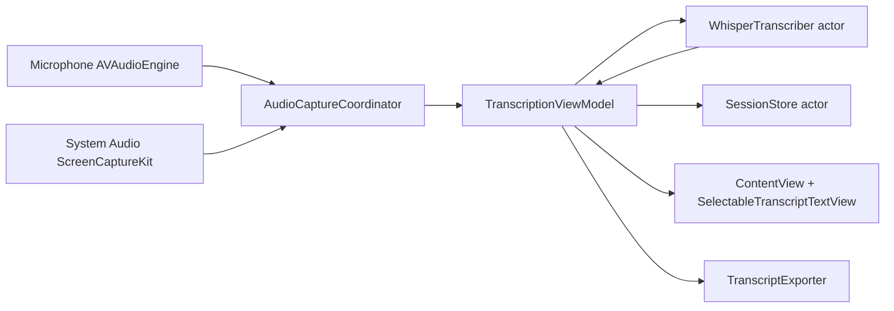

# Livescript Technical Design (Updated to Current Code)

## Product Scope (Implemented v1)
- macOS floating live transcription window built with SwiftUI.
- Capture from microphone, system audio, or both (`Mic`, `System`, `Mixed`).
- Fully on-device ASR via WhisperKit with automatic language detection (`zh`, `en`, mixed).
- Local transcript export (`.txt`, `.md`).
- Best-effort stealth behavior for screen sharing/screen capture (`NSWindow.sharingType = .none`).
- Long-session resilience using session checkpoints and append logs.

## Current Architecture

## Module Design

### 1) App and UI
- `LivescriptApp` injects a shared `TranscriptionViewModel`.
- `ContentView` provides:
  - source mode picker (`Mic`, `System`, `Mixed`)
  - start/stop controls
  - model folder management
  - live status text, session timer, and export menu
  - system capture state + quick-link to privacy settings when denied/error
  - mic/system level meters for setup diagnostics
- Transcript display uses `SelectableTranscriptTextView` (`NSTextView`) for reliable multi-line text selection.
- Speaker labels are colorized and repeated labels are visually suppressed when the same speaker continues.

### 2) Audio Capture
- `AudioCaptureCoordinator` handles independent per-source streams:
  - mic via `AVAudioEngine` tap + conversion to mono 16 kHz float PCM
  - system audio via `ScreenCaptureKit` (`SCStream`) audio output
- Emits typed chunks:
  - `CapturedAudioChunk(source: .mic/.system, samples: [Float])`
- Emits explicit `SystemCaptureStatus`:
  - `notStarted`, `starting`, `running`, `denied(message)`, `error(message)`
- Permission hardening:
  - uses `CGPreflightScreenCaptureAccess` / `CGRequestScreenCaptureAccess`
  - surfaces detailed domain/code error context on failures

### 3) Transcription Pipeline
- `TranscriptionViewModel` manages two independent rolling buffers (`micBuffer`, `systemBuffer`).
- Chunk policy:
  - fixed 3-second windows (48,000 samples @ 16 kHz)
  - non-overlapping pop to reduce duplicate text
- Performance policy:
  - audio ingestion remains on main actor only for state updates
  - Whisper decode runs in background tasks
  - model calls are serialized by `WhisperTranscriber` actor
- Quality policy:
  - silence gate (RMS threshold)
  - simple hallucination phrase filter
  - mixed-mode echo bleed suppression: if mic energy tracks active system playback, suppress mic transcript line

### 4) Whisper Model Handling
- `WhisperTranscriber`:
  - local-first model resolution from a selected base folder
  - automatic fallback download when local model unavailable
  - progress/status callback for UI
- Current fallback variant in code: `large-v3-v20240930_626MB`
- Decoding options tuned for low latency and stability:
  - `temperature = 0.0`
  - `detectLanguage = true`
  - `withoutTimestamps = true`
  - `wordTimestamps = false`
  - `skipSpecialTokens = true`
  - `suppressBlank = true`
  - tuned `logProbThreshold`, `firstTokenLogProbThreshold`, `noSpeechThreshold`

### 5) Speaker Handling
- `TranscriptSegment` includes optional `speakerLabel`.
- In active mixed-mode UI behavior, speaker label is source-based:
  - mic path => `You`
  - system path => `System`
- `SpeakerDiarizer` service exists and is wired/configurable, but current primary UI labels are source labels (not full person-level diarization in final rendering path).

### 6) Storage and Export
- `SessionStore` persists checkpoint snapshots and append logs for long sessions and crash resilience.
- Session folder is selected at start time (`custom_each_time` workflow).
- `TranscriptExporter` currently supports:
  - `.txt`
  - `.md`

## Data Model (Current)
- `TranscriptSession`
  - `id`, `startedAt`, `endedAt`, `sourceMode`, `segments`
- `TranscriptSegment`
  - `id`, `timestamp`, `text`, `isFinal`, `language`, `speakerLabel`

## Privacy and Permissions
- Floating window uses capture exclusion as best effort.
- Required runtime permissions:
  - Microphone
  - Screen & System Audio Recording (for `System` / `Mixed`)
- UI explicitly surfaces capture status and errors to reduce silent failure states.

## Performance and Reliability Notes
- Latency improvements implemented:
  - reduced chunk size to 3s
  - moved decode work off main actor
  - disabled timestamp decoding
- Accuracy improvements implemented:
  - stricter decode thresholds
  - hallucination filtering
  - speaker-echo suppression in mixed mode
- Long session support:
  - periodic checkpointing and append logs
  - rolling buffers instead of unbounded raw audio growth

## Known Limitations (Current Code)
- No partial-token UI; transcript shows finalized chunk-level text.
- Speaker identity in UI is source-level (`You`/`System`) rather than full multi-person diarization.
- Export formats limited to `.txt` and `.md`.
- Capture exclusion remains best-effort across third-party sharing tools.

## Next Technical Steps
1. Add optional model profile/runtime picker (speed vs quality variants).
2. Add optional word timestamps and timeline UI mode.
3. Integrate diarization output into final displayed labels when confidence is stable.
4. Add additional export formats (`.json`, `.srt`) and speaker-aware formatting options.
5. Add automated tests for mixed-mode gating and segment de-dup behavior.
