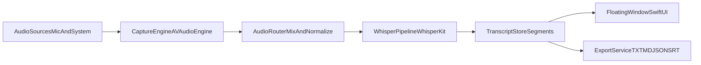

# Meeting Live Transcriptor Technical Design

## Product Scope
- Build a macOS app with a minimal floating window that always stays visible during meetings.
- Ingest audio from both microphone and system output (Zoom, Google Meet, browser, etc.) in v1.
- Run fully on-device transcription using WhisperKit with mandatory automatic language detection for zh/en/mixed speech (no manual language selector).
- Show real-time partial + finalized transcript segments and support export to local files.
- The floating window must be hidden from common screen sharing and screen capture paths (best-effort with macOS capture exclusion APIs).
- Support continuous single-session transcription for meetings longer than 2 hours.

## Architecture

## Core Modules
- **App Shell & Windowing**: custom floating panel (`NSPanel` + SwiftUI host) with translucency, rounded corners, compact controls (start/pause, source, export).
- **Audio Capture Layer**:
  - Mic input via `AVAudioEngine` input node.
  - System audio capture via macOS system-audio path (ScreenCaptureKit or aggregate/virtual route abstraction, selected at runtime).
  - Optional source mixer for `micOnly`, `systemOnly`, `micPlusSystem`.
- **Streaming ASR Layer (WhisperKit)**:
  - Frame/chunk buffering (e.g. 0.5-1.0s windows) and incremental decoding.
  - Segment stabilization policy: partial text (gray) then finalized text (solid).
  - Model profile presets: `quality` (larger multilingual model) vs `balanced` (smaller model).
- **Language Controller**:
  - Fixed `auto` mode only (no user choice).
  - Detect `zh`, `en`, and mixed speech dynamically with confidence smoothing to reduce rapid language flip.
  - Persist detected language tags per segment for later export and filtering.
- **Stealth Window Controller**:
  - Apply capture-exclusion flags (for example `NSWindow.sharingType = .none`) to keep window out of system capture streams when supported.
  - Verify against screenshot APIs and ScreenCaptureKit-based recording/sharing paths.
  - Fallback mode: one-click hide/show hotkey for edge cases where third-party tools ignore exclusion flags.
- **Transcript Domain Store**:
  - Session-based model (`TranscriptSession`, `TranscriptSegment` with start/end time, source, language, text, confidence).
  - In-memory live store + periodic local checkpoint save for crash resilience.
  - Long-session support with incremental disk append and bounded in-memory window.
- **Export Layer**:
  - File formats: `.txt` (plain), `.md` (timestamped), `.json` (structured), `.srt` (subtitle-style).
  - Save panel with session naming and default output directory.

## UI/UX Design
- Floating transcript card:
  - Header: source selector, start/stop, settings.
  - Body: auto-scrolling transcript feed, partial text style distinct from finalized text.
  - Footer: session timer + export button.
- Visual design principles:
  - Minimal chrome, high contrast typography, adaptive dark/light mode, blur background.
  - Non-intrusive width/height constraints and drag-to-move.
- Accessibility:
  - Adjustable font size, keyboard shortcuts, VoiceOver labels.
- Privacy behavior:
  - Always default to capture-exclusion enabled.
  - Show an explicit "Hidden from capture: On/Best effort" status chip so user can trust behavior.

## Audio Input Strategy for Meeting Apps
- Treat Zoom/Google Meet/browser as generic system-audio producers, not app-specific integrations.
- Provide source profiles:
  - `Mic` for user speech.
  - `System` for meeting playback.
  - `Mixed` for both.
- Permission flows:
  - Microphone permission.
  - Screen/system capture permission if using ScreenCaptureKit path.
- Add audio health indicators (input level, clipping, silence) to guide setup.

## Performance and Reliability
- Use backpressure-safe queues between capture and ASR.
- Bound memory with rolling audio buffers and capped transcript history in UI.
- Keep inference off main thread; UI updates on main actor only.
- Recovery handling for model download/init failures, audio interruption, permission denial.
- 2+ hour meeting support:
  - Rotate audio/transcript chunks at fixed intervals (for example every 5 minutes) with atomic writes.
  - Keep only recent context in RAM; reload older segments from local store on demand.
  - Add periodic health checks (queue lag, decode latency, memory watermark) and auto-recovery if lag spikes.

## Data Model (v1)
- `TranscriptSession`: id, startTime, endTime, sourceMode, languageMode, modelProfile.
- `TranscriptSegment`: id, sessionId, startSec, endSec, text, isFinal, languageCode, source, confidence.
- `ExportRecord`: sessionId, format, fileURL, exportedAt.
- `SessionChunk`: sessionId, chunkIndex, startedAt, endedAt, localAudioPath, localTranscriptPath, checksum.

## Model Compatibility Decision
- Evaluated local model path:
  - `/Users/lei_shi/.cache/huggingface/hub/models--mlx-community--whisper-large-v3-turbo/snapshots/a4aaeec0636e6fef84abdcbe3544cb2bf7e9f6fb`
- Current files indicate an MLX model package (`library_name: mlx`, `weights.safetensors`) intended for `mlx-whisper` Python runtime.
- WhisperKit in this app expects WhisperKit/CoreML-compatible model artifacts, so this MLX snapshot is not a direct drop-in for WhisperKit.
- Plan:
  - Use WhisperKit-supported model assets for in-app inference.
  - Keep your MLX model as an optional future backend only if we add a separate MLX runtime bridge.

## Suggested File/Code Organization
- `/Users/lei_shi/workspace/Livescript/Livescript/LivescriptApp.swift`: app entry, dependency bootstrap.
- `/Users/lei_shi/workspace/Livescript/Livescript/ContentView.swift`: replace with floating transcript UI host.
- New folders:
  - `Livescript/UI/` (views + panel bridge)
  - `Livescript/Audio/` (capture engine, source routing)
  - `Livescript/Transcription/` (Whisper pipeline, language controller)
  - `Livescript/Domain/` (session/segment models, store)
  - `Livescript/Export/` (writers for txt/md/json/srt)

## Implementation Phases
- **Phase 1 - Vertical Slice**: floating window + mic-only live transcription + plain text export + auto language detect only.
- **Phase 2 - System Audio and Stealth**: add system capture path, source mixer, and capture-exclusion behavior validation.
- **Phase 3 - Mixed Language Quality**: tune mixed zh/en detection stability and segment confidence logic.
- **Phase 4 - Long Session and Export Polish**: 2+ hour reliability hardening, chunk persistence, multi-format export, and onboarding UX.

## Test Plan
- Unit tests for segment merge/finalization logic and export format writers.
- Integration tests for permission states and audio-source switching.
- Manual acceptance scenarios:
  - English-only call, Chinese-only call, mixed bilingual call.
  - Zoom app audio, Google Meet in browser, local video playback.
  - Long session (>=2 hours) for memory/performance stability.
  - Screen share and recording validation: verify window is excluded in common capture tools; verify fallback quick-hide behavior.

## Key Risks and Mitigations
- **System audio capture variability** across macOS versions/devices: add pluggable capture backends and clear setup diagnostics.
- **Real-time latency** with large multilingual models: expose model profile toggle and chunk-size tuning.
- **Language switching instability** in mixed speech: use hysteresis smoothing and confidence thresholds before switching dominant language labels.
- **Permission friction**: first-run checklist with actionable error states.
- **Capture exclusion not universal** across all third-party meeting tools: treat as best-effort, include live status and instant hide hotkey.
- **Model format mismatch** (MLX vs WhisperKit/CoreML): standardize on WhisperKit model package for v1.

## Definition of Done for v1
- Floating live transcript window works while user is in meetings.
- Mic + system audio capture both function on supported macOS.
- zh/en/mixed transcription quality is acceptable with real-time updates and automatic language detection.
- User can export transcript locally in at least `.txt` and `.md`.
- Capture-exclusion behavior is enabled and validated on target screen sharing/capture workflows.
- Single uninterrupted transcription session can run for 2+ hours without critical memory growth or transcript loss.
